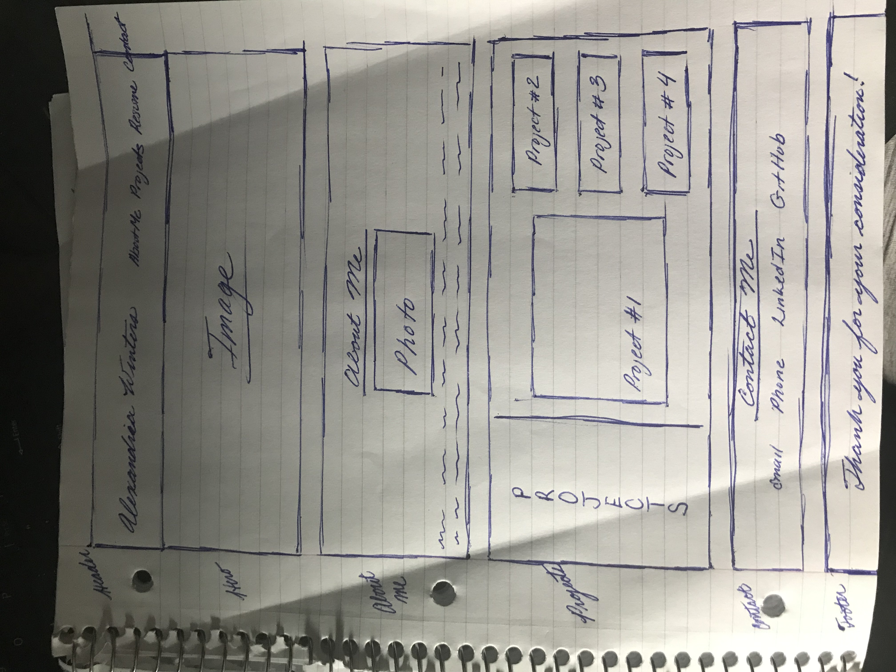

# My-Portfolio

<h2>Purpose</h2>
A website showcasing my skills and the numerous projects done thoroughout the course.

<h2>Built With</h2>
HTML
CSS

<h2>Website</h2>
https://awinters81.github.io/My-Portfolio/

<h2>Contribution</h2>
Created by Alexandria Winters

<h2>Screenshots</h2>

